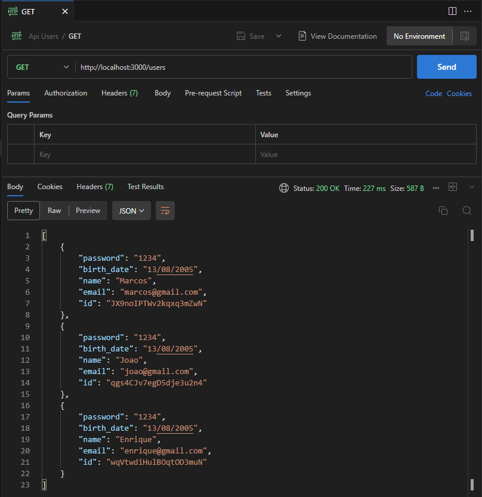
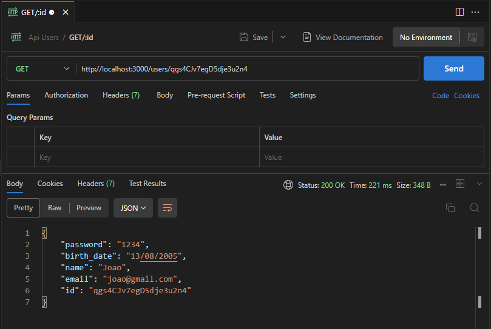
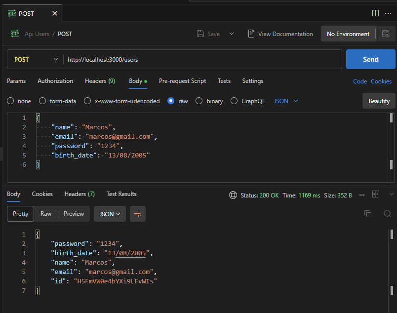
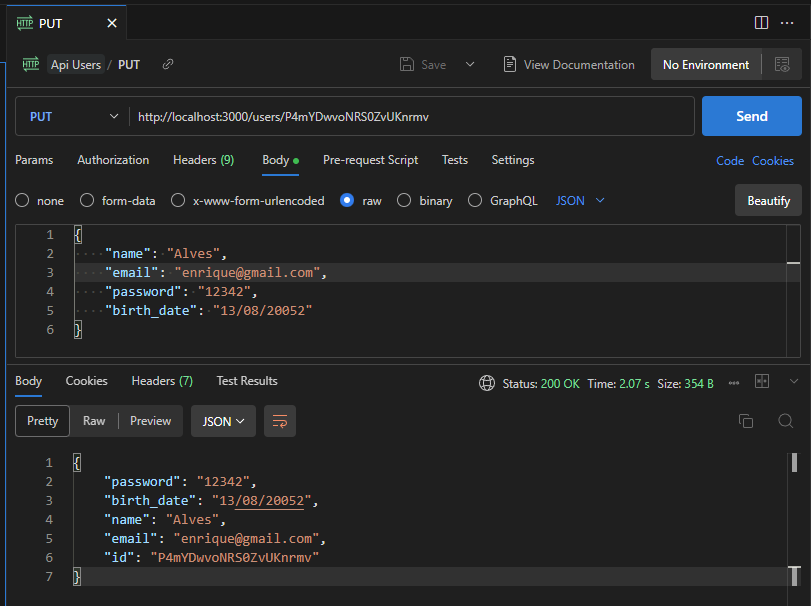
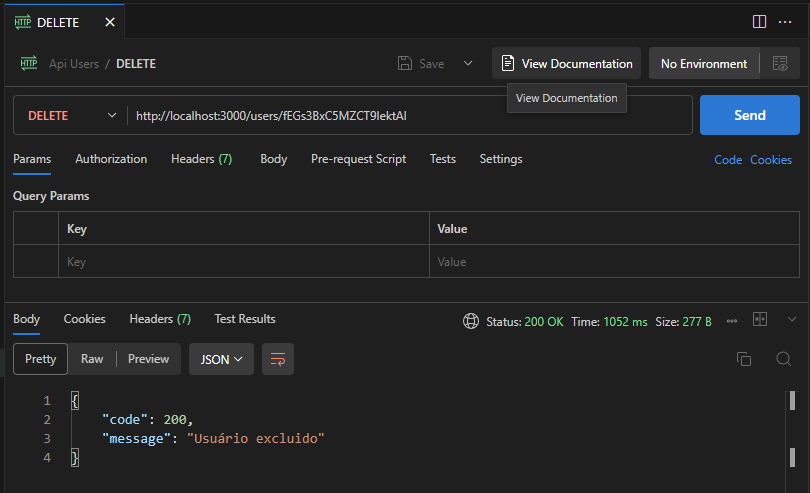

# API RESTful - Nodejs, Firestore e Docker
API com padrão RESTful para CRUD de usuários com Nodejs, Firestore e Docker

# GET users

# GET users/{id}

# POST users

# PUT users/{id} 

# DELETE users/{id}
